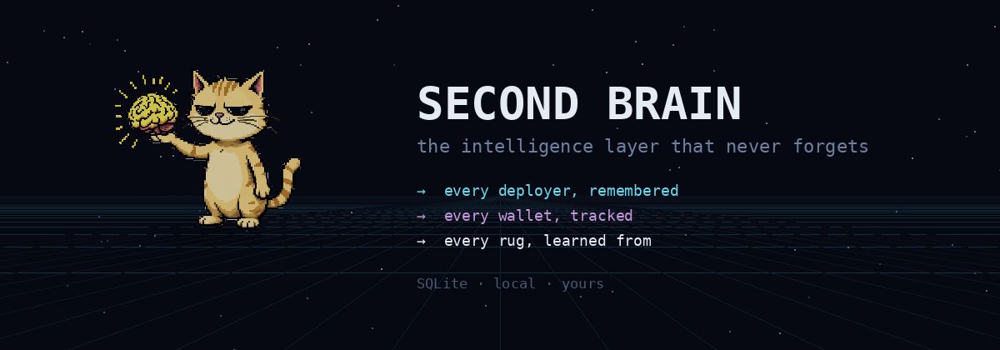
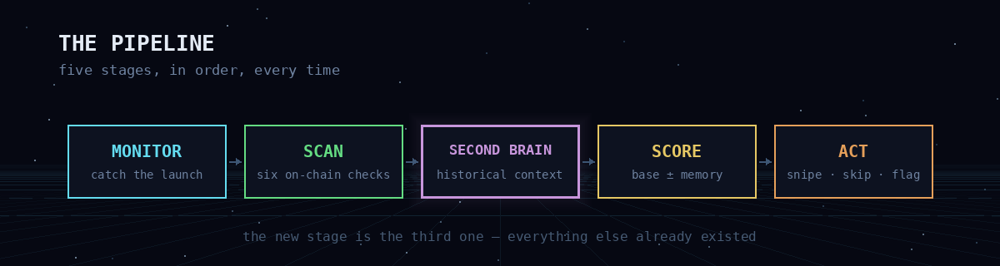
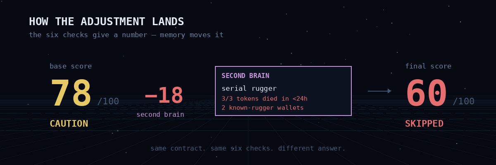
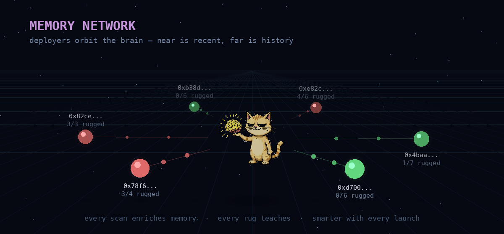

<div align="center">


A scam filter that watches the chain so you don't have to.

New tokens launch every minute. Most of them are designed to take your money. This tool catches them before you click buy — and it **remembers** every deployer it has ever seen.

node 18+ · three chains · second brain · MIT

</div>

---

## The thirty seconds

```
git clone https://github.com/andreysuperiorgit/aegis.git && cd aegis
npm install && cd client && npm install && cd ..
cp .env.example .env

npm run dev
```

```
  aegis v0.2.0 · multi-chain scam filter · http://localhost:3000

  ● Solana     Pump.fun → Jupiter
  ● Robinhood  Pons V2  → Uniswap V4
  ● Base       Clanker  → Uniswap V3

  second brain: 0 tokens seen — it starts empty and learns as you run it

  listening.
```

Open **localhost:3000** and paste any contract address. Or let it watch — every new launch gets scanned, scored, and remembered the moment it appears.

---

## What it is

Three things that usually live apart, in one dashboard.

**A scanner.** Six on-chain checks, weighted and scored 0–100. Mint authority, freeze authority, holder concentration, bundle detection, LP lock status, metadata flags. Each answers one question: can the creator take your money?

**A sniper.** When a token clears your threshold, AEGIS buys through Jupiter or Uniswap before the crowd arrives. When it fails, AEGIS skips and tells you why. No manual decisions at 3 AM.

**A memory.** Every deployer, wallet, and token AEGIS has ever scanned, kept on your disk. The system gets sharper the longer it runs. That is the **Second Brain**.

---



## The Second Brain

The six checks tell you what a token **is right now**. The Second Brain tells you what the people behind it have **done before**.

A contract scan is a snapshot. A competent rugger passes all six checks every single time — that is the point of being competent. What they cannot hide is the pattern across launches: the same funding wallet, the same LP-pull timing, the same three bot wallets in the first block.

Every scan writes to a local SQLite file. Every future scan reads from it.



### What it tracks

**Deployers.** Every address that created a token AEGIS scanned. How many they launched, how many rugged, how many are still alive. A deployer with 3 rugs and no survivors starts at **−15** before a single check runs.

**Wallets.** Addresses that appeared in bundle buys. Addresses tagged `smart_money`. Addresses flagged `known_rugger`. When they show up in a new token's first buys, AEGIS already knows them.

**Tokens.** Everything AEGIS has seen, with its score, verdict, and later status. `updateTokenStatus()` marks each as `live` / `rugged` / `abandoned`. That feedback loop is what turns deployer reputation into something real instead of a guess.

### The adjustment

Memory moves the score by up to **±25**.



```
serial rugger · deployer 0x4c…9a · 3/3 rugged            → −15
2 known-rugger wallets in first buys                      → −10
smart money bought in the first three blocks              → +10
trusted deployer · 5/6 tokens alive after 30 days         → +10
```

A token scoring 78 on-chain with −18 from memory lands at 60 — **CAUTION**, not **SAFE**. Same contract, same six checks, different answer.



### Your data, your disk

The database lives at `data/memory.db`. Override with `AEGIS_MEMORY_PATH`. It is plain SQLite, so query it directly:

```sh
sqlite3 data/memory.db "SELECT address, tokens_rugged, tokens_total
                        FROM deployers
                        WHERE tokens_rugged >= 3
                        ORDER BY tokens_rugged DESC LIMIT 20;"
```

Or use the CLI:

```sh
npm run memory:stats                          # top ruggers, smart money, totals
npm run memory:flag -- --address 0x… \
                     --chain base \
                     --smart "wallet from @proof_of_pizza"
```

Nothing leaves your machine. No telemetry, no shared database, no analytics ping. Want to share intel with a team? Copy the `.db` file.

---

## The idea

Every chain has a block explorer. None of them tell you whether to click buy. None of them tell you the deployer already rugged three tokens this month.

66.8% of Pons V2 wallets lost money. 80% of $LAPTOP buyers lost money. Those are not outliers — that is the base rate when you trade on vibes.

AEGIS runs six checks, asks the Second Brain what it remembers, and produces a number. The number is not a prediction. It measures how many escape hatches the creator left open, and how often they have used them before.

---

## The six checks

Because a score without a method is a guess.

| # | what it checks | weight | what it catches |
|:---:|:---|:---:|:---|
| 1 | mint authority | 20 | creator can print unlimited tokens |
| 2 | freeze authority | 15 | creator can freeze your wallet — honeypot |
| 3 | holder concentration | 20 | top 10 wallets hold too much supply |
| 4 | bundle detection | 20 | coordinated first buys from related wallets |
| 5 | LP status | 15 | liquidity not locked or burned |
| 6 | metadata flags | 10 | suspicious name, supply, or contract code |
| + | **second brain** | **±25** | **who the deployer is and what they did before** |

**80+** relatively clean · **60–79** caution · **40–59** warning · **below 40** danger

Weights live in `src/aegis/utils/score.js`. Change them and the scores change. Nothing hides behind a model.

---

## The terminal

Not a mock-up: a real scan, captured frame by frame.


The header carries the pulse at all times:

```
A E G I S  ·  3 chains  ·  scanning  ·  2,847 seen  ·  312 deployers tracked  ·  3 sniped
```

One rule for colour: **cyan** is being scanned, **green** is clean, **gold** needs attention, **red** will take your money, **purple** is what memory remembers. If every pane glowed, none of them would mean anything.

```
1  SCAN       the token, every check                  enter scan
2  SCORE      the breakdown, bar by bar               s snipe
3  MONITOR    live feed from all chains               c chains
4  MEMORY     what the second brain adds              m memory
5  PULSE      the numbers — clean, rug, ratio         r review
```

---

## The $LAPTOP case


September 9, 2026. Hunter Biden launched $LAPTOP on Base. It hit $199, then crashed to $0.87 in ninety minutes. $48K of liquidity backing a $144B fully diluted valuation. 80% of buyers lost money.

AEGIS would have scored it **below 20** and auto-skipped:

```
→ scanning $LAPTOP on Base (chain 8453)

  mint_authority:       ACTIVE                    ✗  20/20 → 0
  freeze_authority:     ACTIVE                    ✗  15/15 → 0
  holder_concentration: 68.2% top 10              ✗  20/20 → 0
  bundle_detection:     4 coordinated wallets     ✗  20/20 → 0
  lp_locked:            0%                        ✗  15/15 → 0
  metadata:             suspicious ($144B FDV)    ⚠  10/10 → 4

  base score:           4/100

→ second brain: −10
  2 known-rugger wallets in first buys

→ final score: 0/100 — DANGER
→ action: SKIP
```

100M tokens (10% of supply) went to the project wallet before launch. 42.5M were dumped by an insider at open. Market makers held tokens days before public trading. Every one of those is a check AEGIS runs, and every one failed.

The two wallets that dumped had appeared in three other rugs that week. The Second Brain remembered them.

That is not hindsight. That is six `if` statements and a lookup.

---

## The chains

```
network              chain id    launchpad       DEX
─────────────────────────────────────────────────────
Solana               —           Pump.fun        Jupiter
Robinhood Chain      4663        Pons V2         Uniswap V4
Base                 8453        Clanker         Uniswap V3
```

Each chain has its own monitor, scanner, and sniper. They share a score engine, one Second Brain, and one dashboard. A deployer caught rugging on Base is already known when they appear on Solana.

---

## Grok

Optional. After each scan, results go to xAI's Grok for a plain-language risk breakdown — what is wrong, what is right, BUY / CAUTION / AVOID with reasons.

Free $175/month API credits from xAI. Each scan costs about $0.0001.

```json
{
  "analysis": "Extremely high risk. Mint authority active. Freeze functions
               in bytecode. Top wallet holds 10% with pre-launch allocation.
               $48K liquidity backing $144B FDV. Second Brain flags 2
               known-rugger wallets in the first buys.",
  "recommendation": "AVOID",
  "confidence": "HIGH",
  "red_flags": [
    "Active mint authority",
    "Freeze/pause in contract",
    "42.5M tokens pre-allocated",
    "$48K vs $144B FDV",
    "Known-rugger wallets buying"
  ],
  "green_flags": []
}
```

Delete `src/aegis/ai/grok.js` and everything else still works. The scanner does not need a language model to count wallets.

---

## The API

```bash
# Scan — response includes the memory adjustment
curl http://localhost:3001/api/scan/solana/TOKEN_ADDRESS
curl http://localhost:3001/api/scan/robinhood/0xTOKEN
curl http://localhost:3001/api/scan/base/0xTOKEN

# Second Brain
curl http://localhost:3001/api/memory/stats
curl http://localhost:3001/api/memory/deployer/0xDEPLOYER

# Monitoring
curl -X POST http://localhost:3001/api/monitor/start \
  -H "Content-Type: application/json" -d '{"chain":"solana"}'
```

```
method  endpoint                       what it does
───────────────────────────────────────────────────────────────
GET     /api/scan/solana/:address      scan a Solana token
GET     /api/scan/robinhood/:address   scan a Robinhood Chain token
GET     /api/scan/base/:address        scan a Base token
GET     /api/memory/stats              second brain totals
GET     /api/memory/deployer/:addr     deployer history
GET     /api/monitor/status            monitor status
POST    /api/monitor/start             start chain monitor
POST    /api/monitor/stop              stop chain monitor
WS      /ws                            live event stream
```

Every scan response carries memory:

```jsonc
{
  "chain": "base",
  "mint": "0x…",
  "baseScore": 78,
  "memory": {
    "adjustment": -18,
    "reasons": [
      "serial rugger: 3/3 tokens died",
      "2 known-rugger wallets in first buys"
    ],
    "deployer": { "tokens_total": 3, "tokens_rugged": 3 }
  },
  "finalScore": 60,
  "verdict": "CAUTION"
}
```

---

## On disk

```
aegis/
├── src/aegis/
│   ├── index.js                  the entry point
│   ├── ai/
│   │   └── grok.js               xAI risk analysis — optional
│   ├── memory/                   ── SECOND BRAIN ──
│   │   ├── db.js                 SQLite schema + connection
│   │   ├── lookup.js             enrichScan() → adjustment + reasons
│   │   ├── record.js             recordToken, recordBundle, flagWallet
│   │   └── index.js              public API
│   ├── monitors/
│   │   ├── solana.monitor.js     Pump.fun via logsSubscribe
│   │   ├── robinhood.monitor.js  Pons V2 via TokenCreated
│   │   └── base.monitor.js       Clanker via PoolCreated
│   ├── scanners/
│   │   ├── solana.scanner.js     SPL checks + memory enrich
│   │   ├── robinhood.scanner.js  EVM checks + memory enrich
│   │   ├── base.scanner.js       EVM checks + memory enrich
│   │   └── rugcheck.js           RugCheck API
│   ├── sniper/
│   │   ├── jupiter.sniper.js     Solana swaps via Jupiter
│   │   └── uniswap.sniper.js     EVM swaps via Uniswap
│   ├── api/
│   │   └── server.js             Express + WebSocket
│   └── utils/
│       ├── constants.js          addresses, weights
│       ├── score.js              the six checks, the math
│       └── logger.js             coloured terminal output
├── client/                       React + Vite dashboard
├── data/                         second brain SQLite (gitignored)
│   └── memory.db
├── scripts/
│   ├── scan.js                   CLI scan
│   ├── monitor.js                CLI monitor
│   ├── memory-stats.js           npm run memory:stats
│   └── memory-flag.js            npm run memory:flag
└── assets/                       the images on this page
```

No build step beyond `npm install`. No bundler config to debug. The client is Vite + React, the server is Express, the scanners are plain functions that take an address and return a score, and the Second Brain is one SQLite file.

---

## Configuration

```
variable              required   default          what it does
──────────────────────────────────────────────────────────────────
SOLANA_RPC_URL        ✓          public RPC       Solana HTTP endpoint
SOLANA_WS_URL         ✓          public WS        Solana WebSocket
ROBINHOOD_RPC_URL     —          public RPC       Robinhood Chain (4663)
BASE_RPC_URL          —          public RPC       Base (8453)
AEGIS_MEMORY_PATH     —          data/memory.db   second brain location
XAI_API_KEY           —          —                Grok (console.x.ai)
SNIPER_ENABLED        —          false            ⚠ uses real funds
PORT                  —          3001             server port
```

`cp .env.example .env` and fill in the keys you have. Everything without a ✓ falls back to a default. The Second Brain needs no setup — SQLite creates the file on the first scan.

---

## What it refuses

The sniper is off by default. Turning it on means setting `SNIPER_ENABLED=true` and confirming you understand it spends real money. There is no "just try it" mode for funds.

The Second Brain never phones home. If that ever changes, it will be a flag you opt into, not a default you discover.

---

## The shape of the scan

Chains, tokens, and deployers as nodes, with edges drawn from memory. The red and orange cloud is danger: tokens scored below 40, flagged before anyone bought.


In most launches that cloud is a third of everything, and it is invisible to anyone checking a block explorer — which is why people keep believing the chain is safe.

---

## Honest limits

```
The scanner reads on-chain state. It does not read intentions.
A token can pass all six checks and still go to zero — that is called risk.
The Second Brain is only as good as what you have fed it. It starts empty.
It cannot recognise a deployer using a fresh wallet. Nothing can, on day one.
The sniper buys tokens. Tokens lose value. That is what they do.
Grok's opinion is a language model's opinion, with the same failure modes.
The score is six if-statements, a lookup, and a weighted sum. Not a model.
Nothing here predicts anything. It measures what is on chain right now,
  plus what AEGIS has already seen.
```

---

## Roadmap

```
done                                    planned
──────────────────────────────────────────────────────────────
✓ token scanner (3 chains)              ○ Telegram alerts bot
✓ safety score engine                   ○ advanced bundle detection (Jito)
✓ live monitoring                       ○ background token-status job
✓ React dashboard                       ○ deployer clustering (funder graph)
✓ Grok AI integration                   ○ shared second brain (opt-in)
✓ Jupiter sniper                        ○ full Uniswap V4 sniper
✓ second brain (SQLite memory)          ○ TON, BNB Chain support
✓ deployer / wallet reputation          ○ GraphQL for memory queries
```

---

<div align="center">


<br/>

**Built with paranoia. Remembers everything.** Licensed under [MIT](LICENSE).

[Contributing](CONTRIBUTING.md) · [Changelog](CHANGELOG.md)

</div>
