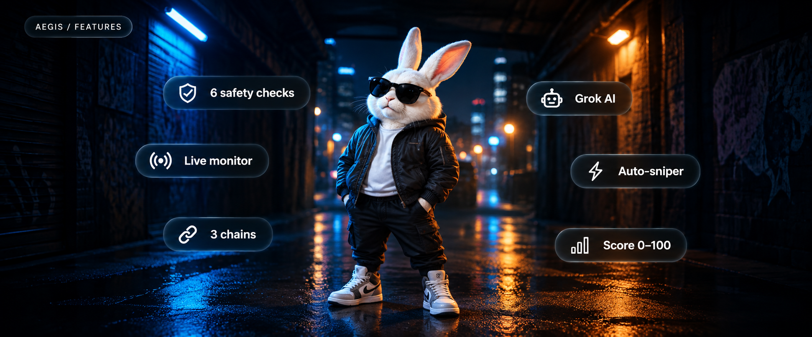
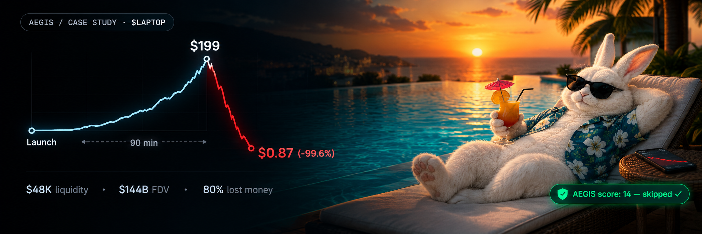

<div align="center">


<h1 align="center">AEGIS</h1>

<p align="center"><b>Multi-chain scam filter + smart sniper.</b> Scans tokens. Catches rugs. Snipes clean launches.</p>

<p align="center">
<a href="#-start-locally">Install</a> · <a href="#-how-it-works">Docs</a> · <a href="#-api">API</a> · <a href="CONTRIBUTING.md">Contribute</a>
</p>

[](LICENSE)
[](https://nodejs.org)
[]()
[]()

</div>

---

AEGIS monitors new token launches on **Solana** (Pump.fun), **Robinhood Chain** (Pons V2), and **Base** (Clanker) in real time. Each token runs through 6 on-chain checks, receives a safety score 0–100, and optionally gets an AI risk analysis via Grok. Tokens above your threshold get auto-sniped through Jupiter or Uniswap.

66.8% of Pons V2 wallets lost money. 80% of $LAPTOP buyers lost money. This tool exists because of that.

---

## 🔍 How it works


| Monitor | Scan | Score & Act |
|:---|:---|:---|
| **Real-time launch detection** | **6 on-chain checks** | **AI-powered decisions** |
| Subscribes to Pump.fun, Pons V2, and Uniswap V3 Factory via WebSocket. Every new token caught within seconds. | Checks mint authority, freeze authority, holder concentration, bundle detection, LP lock status, and metadata flags. | Weighted score 0–100. Grok AI gives a plain-language risk breakdown. Auto-sniper buys only tokens above your threshold. |

---

## ⛓️ Chains

| Chain | Launchpad | DEX | Chain ID |
|:---|:---|:---|:---|
| **Solana** | Pump.fun | Jupiter | — |
| **Robinhood Chain** | Pons V2 | Uniswap V4 | 4663 |
| **Base** | Clanker / Aerodrome | Uniswap V3 | 8453 |

---

## 🛡️ Features



| # | Check | Weight | Detects |
|:---:|:---|:---:|:---|
| 1 | Mint authority | 20 | Creator can print unlimited tokens |
| 2 | Freeze authority | 15 | Creator can freeze your wallet (honeypot) |
| 3 | Holder concentration | 20 | Top 10 wallets hold too much supply |
| 4 | Bundle detection | 20 | Coordinated first buys from related wallets |
| 5 | LP status | 15 | Liquidity not locked or burned |
| 6 | Metadata flags | 10 | Suspicious name, supply, or contract code |

Score **80+** → relatively clean · **60–79** → caution · **40–59** → warning · **Below 40** → danger

---

## ⛔ The $LAPTOP case



September 9, 2026. Hunter Biden launched $LAPTOP on Base. It hit $199, then crashed to $0.87 in 90 minutes. $48K liquidity backing a $144B FDV. 80% of buyers lost money.

AEGIS would have scored it **below 20** and auto-skipped.

| What happened | AEGIS flag |
|:---|:---|
| 100M tokens (10% supply) sent to project wallet before launch | ⛔ Holder concentration: DANGER |
| $48K liquidity at $144B fully diluted valuation | ⛔ LP status: DANGER |
| 42.5M tokens dumped by insider wallet at open | ⛔ Bundle detection: DANGER |
| Market makers received tokens days before public trading | ⛔ Insider allocation |

---

## 🤖 Grok AI

Optional. After each scan, results go to xAI's Grok for a plain-language risk analysis: what's wrong, what's right, BUY / CAUTION / AVOID with red and green flags.

Free $175/month API credits from xAI. Each scan costs ~$0.0001.

<details>
<summary>Example output for $LAPTOP</summary>

```json
{
  "analysis": "Extremely high risk. Mint authority active. Freeze functions in bytecode. Top wallet holds 10% with pre-launch allocation. $48K liquidity backing $144B FDV.",
  "recommendation": "AVOID",
  "confidence": "HIGH",
  "red_flags": ["Active mint authority", "Freeze/pause in contract", "42.5M tokens pre-allocated", "$48K vs $144B FDV"],
  "green_flags": []
}
```
</details>

---

## 🚀 Start locally

```bash
# Clone
git clone https://github.com/andreysuperiorgit/aegis.git
cd aegis

# Install
npm install
cd client && npm install && cd ..

# Configure
cp .env.example .env

# Run
npm run dev
```

Open **http://localhost:3000** and paste any contract address.

---

## 📡 API

```bash
# Scan a Solana token
curl http://localhost:3001/api/scan/solana/TOKEN_ADDRESS

# Scan a Robinhood Chain token
curl http://localhost:3001/api/scan/robinhood/0xTOKEN

# Scan a Base token
curl http://localhost:3001/api/scan/base/0xTOKEN

# Start monitoring
curl -X POST http://localhost:3001/api/monitor/start \
  -H "Content-Type: application/json" \
  -d '{"chain":"solana"}'
```

| Method | Endpoint | Description |
|:---|:---|:---|
| GET | `/api/scan/solana/:address` | Scan Solana token |
| GET | `/api/scan/robinhood/:address` | Scan Robinhood Chain token |
| GET | `/api/scan/base/:address` | Scan Base token |
| GET | `/api/monitor/status` | Monitor status |
| POST | `/api/monitor/start` | Start chain monitor |
| POST | `/api/monitor/stop` | Stop chain monitor |
| WS | `/ws` | Live event stream |

---

## 📂 Project layout

```
aegis/
├── src/
│   ├── index.js                 Entry point
│   ├── ai/
│   │   └── grok.js              xAI Grok risk analysis
│   ├── monitors/
│   │   ├── solana.monitor.js    Pump.fun — logsSubscribe
│   │   ├── robinhood.monitor.js Pons V2 — TokenCreated events
│   │   └── base.monitor.js      Clanker — Uniswap V3 PoolCreated
│   ├── scanners/
│   │   ├── solana.scanner.js    SPL token checks
│   │   ├── robinhood.scanner.js EVM checks (owner, bytecode, holders)
│   │   ├── base.scanner.js      EVM checks for Base
│   │   └── rugcheck.js          RugCheck API
│   ├── sniper/
│   │   ├── jupiter.sniper.js    Solana swaps via Jupiter
│   │   └── uniswap.sniper.js    EVM swaps via Uniswap V4
│   ├── api/
│   │   └── server.js            Express + WebSocket server
│   └── utils/
│       ├── constants.js         Contract addresses, weights
│       ├── score.js             Score calculator
│       └── logger.js            Colored logging
├── client/
│   ├── src/
│   │   ├── App.jsx              Dashboard — scan + live feed
│   │   ├── hooks/               useWebSocket
│   │   └── styles/              Dark theme
│   └── vite.config.js           Dev server + proxy
├── assets/                      Banner, pipeline, features, case study
├── examples/                    Sample scan outputs
└── ...config files
```

---

## ⚙️ Configuration

| Variable | Required | Default | Description |
|:---|:---:|:---|:---|
| `SOLANA_RPC_URL` | ✓ | Public RPC | Solana HTTP endpoint |
| `SOLANA_WS_URL` | ✓ | Public WS | Solana WebSocket |
| `ROBINHOOD_RPC_URL` | — | Public RPC | Robinhood Chain (4663) |
| `BASE_RPC_URL` | — | Public RPC | Base (8453) |
| `XAI_API_KEY` | — | — | Grok AI key ([console.x.ai](https://console.x.ai)) |
| `SNIPER_ENABLED` | — | `false` | ⚠️ Uses real funds |
| `PORT` | — | `3001` | Server port |

---

## 🗺️ Roadmap

| Done | Planned |
|:---|:---|
| ✅ Token scanner (3 chains) | ⬜ Telegram alerts bot |
| ✅ Safety score engine | ⬜ Advanced bundle detection (Jito) |
| ✅ Live monitoring | ⬜ Insider wallet tracking |
| ✅ React dashboard | ⬜ Historical score database |
| ✅ Grok AI integration | ⬜ TON, BNB Chain support |
| ✅ Jupiter sniper | ⬜ Full Uniswap V4 sniper |

---

## ⚠️ Disclaimer

Educational and research software. Use at your own risk. No safety score guarantees a token is safe. The sniper uses real funds when enabled. DYOR.

---

<div align="center">


<br/>

**Built with paranoia.** Licensed under [MIT](LICENSE).

[Contributing](CONTRIBUTING.md) · [Changelog](CHANGELOG.md)

</div>
