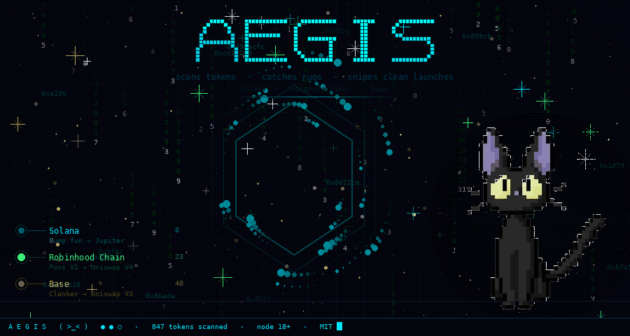
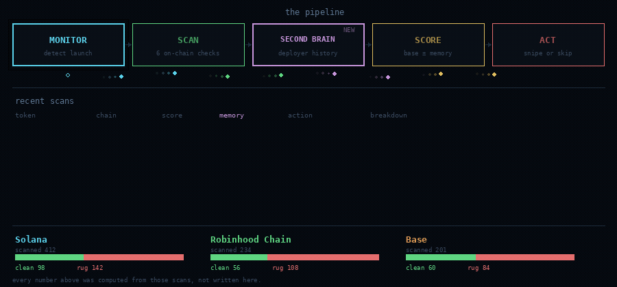
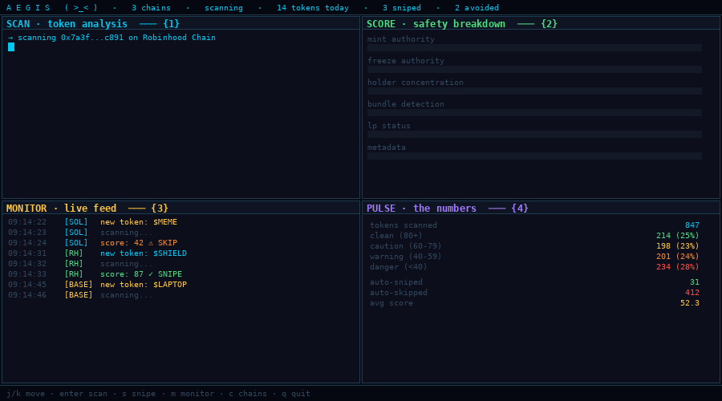
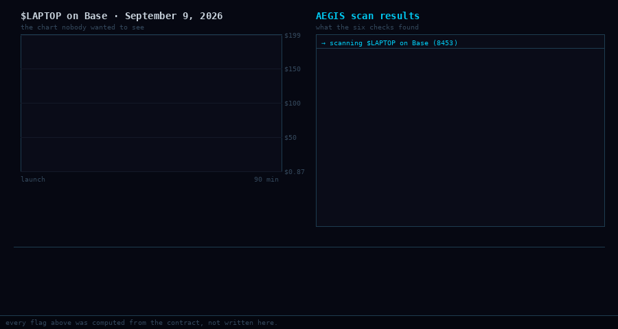
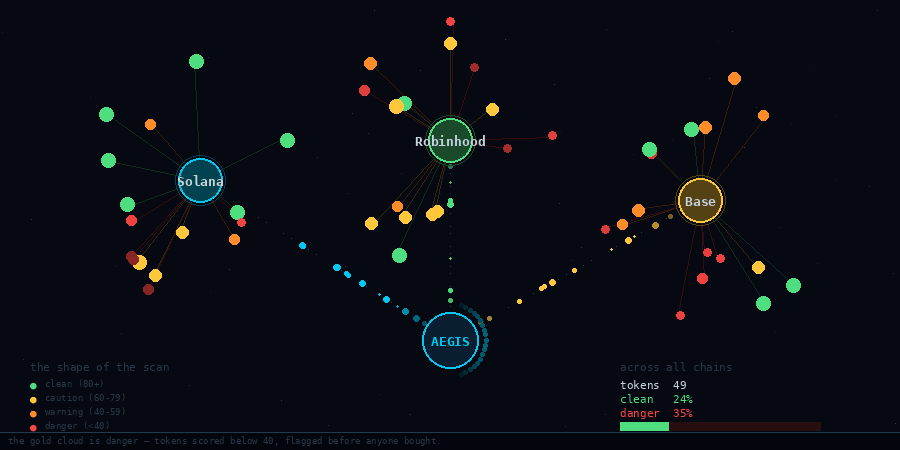

<div align="center">



A scam filter that watches the chain so you don't have to.

New tokens launch every minute. Most of them are designed to take your money. This tool catches them before you click buy.

node 18+ · three chains · MIT

</div>

---

## The thirty seconds

```
git clone https://github.com/andreysuperiorgit/aegis.git && cd aegis
npm install && cd client && npm install && cd ..
cp .env.example .env

npm run dev
```

```
  ( >_< )
  multi-chain scam filter · http://localhost:3000

  ● Solana     Pump.fun → Jupiter
  ● Robinhood  Pons V2  → Uniswap V4
  ● Base       Clanker  → Uniswap V3

  listening.
```

Open **localhost:3000** and paste any contract address. Or let it watch — every new launch gets scanned the moment it appears.

---

## What it is

Two things that usually live apart, in one dashboard.

**A scanner.** Six on-chain checks, weighted and scored 0–100. Mint authority, freeze authority, holder concentration, bundle detection, LP lock status, metadata flags. Each one answers a single question: can the creator take your money?

**A sniper.** When a token passes your threshold, AEGIS buys it through Jupiter or Uniswap before the crowd arrives. When it fails, AEGIS skips it and tells you why. No manual decisions at 3 AM.

And one thing that makes the score mean something.

---

## The idea

Every chain has a block explorer. None of them tell you whether to click buy.

66.8% of Pons V2 wallets lost money. 80% of $LAPTOP buyers lost money. Those are not outliers — that is the base rate when you trade on vibes.

AEGIS runs six checks on every token and produces a number. The number is not a prediction. It is a measurement of how many escape hatches the creator left open. A token with active mint authority and frozen transfers is not necessarily a rug — but every rug in history had at least one of those.

---

## The pipeline



Four stages, in order, every time.

```
MONITOR          detect the launch the moment it hits the chain
     ↓
SCAN             six checks, each with a weight
     ↓
SCORE            0–100, where 0 is certain danger
     ↓
ACT              snipe it, skip it, or flag it for review
```

The monitor subscribes to the factory contract on each chain — Pump.fun's `logsSubscribe` on Solana, `TokenCreated` events on Pons V2, `PoolCreated` on Clanker. Every new token caught within seconds of deployment.

---

## The six checks

Because a score without a method is a guess.

| # | what it checks | weight | what it catches |
|:---:|:---|:---:|:---|
| 1 | mint authority | 20 | creator can print unlimited tokens |
| 2 | freeze authority | 15 | creator can freeze your wallet — honeypot |
| 3 | holder concentration | 20 | top 10 wallets hold too much supply |
| 4 | bundle detection | 20 | coordinated first buys from related wallets |
| 5 | LP status | 15 | liquidity not locked or burned |
| 6 | metadata flags | 10 | suspicious name, supply, or contract code |

**80+** relatively clean · **60–79** caution · **40–59** warning · **below 40** danger

Every weight is in `src/utils/score.js`. Change them, and the scores change. Nothing is hidden behind a model.

---

## The terminal

Not a mock-up: a real scan, captured frame by frame.



The header carries the pulse at all times:

```
A E G I S   ( >_< )   ·   3 chains   ·   scanning   ·   14 tokens today   ·   3 sniped   ·   2 avoided
```

One rule for the colour: **cyan** marks what is being scanned, **green** marks what is clean, **gold** marks what needs attention, **red** marks what will take your money. If every pane glowed, none of them would mean anything.

```
1  SCAN       the token, every check                    enter scan
2  SCORE      the breakdown, bar by bar                 s snipe
3  MONITOR    live feed from all chains                 m monitor
4  PULSE      the numbers — clean, rug, ratio           c chains
```

---

## The $LAPTOP case



September 9, 2026. Hunter Biden launched $LAPTOP on Base. It hit $199, then crashed to $0.87 in ninety minutes. $48K liquidity backing a $144B fully diluted valuation. 80% of buyers lost money.

AEGIS would have scored it **below 20** and auto-skipped. Here is why:

```
→ scanning $LAPTOP on Base (chain 8453)

  mint_authority:       ACTIVE                    ✗  20/20 → 0
  freeze_authority:     ACTIVE                    ✗  15/15 → 0
  holder_concentration: 68.2% top 10              ✗  20/20 → 0
  bundle_detection:     4 coordinated wallets     ✗  20/20 → 0
  lp_locked:            0%                        ✗  15/15 → 0
  metadata:             suspicious ($144B FDV)    ⚠  10/10 → 4

→ score: 4/100 — DANGER
→ action: SKIP
```

100M tokens (10% supply) sent to project wallet before launch. 42.5M dumped by an insider wallet at open. Market makers received tokens days before public trading. Every one of those is a check AEGIS runs. Every one of them failed.

That is not hindsight. That is six `if` statements.

---

## The chains

```
network              chain id    launchpad       DEX
─────────────────────────────────────────────────────
Solana               —           Pump.fun        Jupiter
Robinhood Chain      4663        Pons V2         Uniswap V4
Base                 8453        Clanker         Uniswap V3
```

Each chain has its own monitor, its own scanner, and its own sniper. They share a score engine and a dashboard. Adding a chain means writing one monitor and one scanner — the rest is inherited.

---

## Grok

Optional. After each scan, results go to xAI's Grok for a plain-language risk breakdown. What is wrong, what is right, BUY / CAUTION / AVOID with reasons.

Free $175/month API credits from xAI. Each scan costs ~$0.0001.

```json
{
  "analysis": "Extremely high risk. Mint authority active. Freeze functions
               in bytecode. Top wallet holds 10% with pre-launch allocation.
               $48K liquidity backing $144B FDV.",
  "recommendation": "AVOID",
  "confidence": "HIGH",
  "red_flags": [
    "Active mint authority",
    "Freeze/pause in contract",
    "42.5M tokens pre-allocated",
    "$48K vs $144B FDV"
  ],
  "green_flags": []
}
```

Delete `src/ai/grok.js` and everything else still works. The scanner does not need a language model to count wallets.

---

## The API

```bash
# Scan a Solana token
curl http://localhost:3001/api/scan/solana/TOKEN_ADDRESS

# Scan a Robinhood Chain token
curl http://localhost:3001/api/scan/robinhood/0xTOKEN

# Scan a Base token
curl http://localhost:3001/api/scan/base/0xTOKEN

# Start monitoring
curl -X POST http://localhost:3001/api/monitor/start \
  -H "Content-Type: application/json" \
  -d '{"chain":"solana"}'
```

```
method  endpoint                      what it does
──────────────────────────────────────────────────────────────
GET     /api/scan/solana/:address     scan a Solana token
GET     /api/scan/robinhood/:address  scan a Robinhood Chain token
GET     /api/scan/base/:address       scan a Base token
GET     /api/monitor/status           monitor status
POST    /api/monitor/start            start chain monitor
POST    /api/monitor/stop             stop chain monitor
WS      /ws                           live event stream
```

---

## On disk

```
aegis/
├── src/
│   ├── index.js                  the entry point
│   ├── ai/
│   │   └── grok.js               xAI risk analysis — optional, deletable
│   ├── monitors/
│   │   ├── solana.monitor.js     Pump.fun via logsSubscribe
│   │   ├── robinhood.monitor.js  Pons V2 via TokenCreated events
│   │   └── base.monitor.js       Clanker via PoolCreated
│   ├── scanners/
│   │   ├── solana.scanner.js     SPL token checks
│   │   ├── robinhood.scanner.js  EVM checks — owner, bytecode, holders
│   │   ├── base.scanner.js       EVM checks for Base
│   │   └── rugcheck.js           RugCheck API
│   ├── sniper/
│   │   ├── jupiter.sniper.js     Solana swaps via Jupiter
│   │   └── uniswap.sniper.js     EVM swaps via Uniswap V4
│   ├── api/
│   │   └── server.js             Express + WebSocket
│   └── utils/
│       ├── constants.js          contract addresses, weights
│       ├── score.js              the six checks, the math
│       └── logger.js             colored terminal output
├── client/
│   ├── src/
│   │   ├── App.jsx               dashboard — scan + live feed
│   │   ├── hooks/                useWebSocket
│   │   └── styles/               dark theme
│   └── vite.config.js            dev server + proxy
└── assets/                       the animations on this page
```

That is the whole codebase. No build step beyond `npm install`. No bundler config to debug. The client is Vite + React, the server is Express, and the scanners are plain functions that take an address and return a score.

---

## Configuration

```
variable              required   default      what it does
─────────────────────────────────────────────────────────────────
SOLANA_RPC_URL        ✓          public RPC   Solana HTTP endpoint
SOLANA_WS_URL         ✓          public WS    Solana WebSocket
ROBINHOOD_RPC_URL     —          public RPC   Robinhood Chain (4663)
BASE_RPC_URL          —          public RPC   Base (8453)
XAI_API_KEY           —          —            Grok AI (console.x.ai)
SNIPER_ENABLED        —          false        ⚠ uses real funds
PORT                  —          3001         server port
```

`cp .env.example .env` and fill in the keys you have. Everything without a ✓ has a fallback.

---

## What it refuses

The sniper is off by default. Turning it on requires setting `SNIPER_ENABLED=true` in `.env` and confirming you understand it uses real funds. There is no "just try it" mode for money.

---

## The shape of the scan

The same tokens as a graph — chains and tokens as nodes. The red and orange cloud is danger: tokens scored below 40, flagged before anyone bought. Green got through. Gold needs a second look.



In most launches this is a third of everything, and it is invisible to anyone checking a block explorer, which is why people believe the chain is safe.

---

## Honest limits

```
The scanner reads on-chain state. It does not read intentions.
A token can pass all six checks and still go to zero — that is called risk.
The sniper buys tokens. Tokens lose value. That is what they do.
Grok's opinion is a language model's opinion. It has the same failure modes.
The score is six if-statements and a weighted sum. It is not a model.
Nothing here predicts anything. It measures what is on chain right now.
```

---

## Roadmap

```
done                              planned
────────────────────────────────────────────────
✓ token scanner (3 chains)        ○ Telegram alerts bot
✓ safety score engine             ○ advanced bundle detection (Jito)
✓ live monitoring                 ○ insider wallet tracking
✓ React dashboard                 ○ historical score database
✓ Grok AI integration            ○ TON, BNB Chain support
✓ Jupiter sniper                  ○ full Uniswap V4 sniper
```

---

<div align="center">


<br/>

**Built with paranoia.** Licensed under [MIT](LICENSE).

[Contributing](CONTRIBUTING.md) · [Changelog](CHANGELOG.md)

</div>
